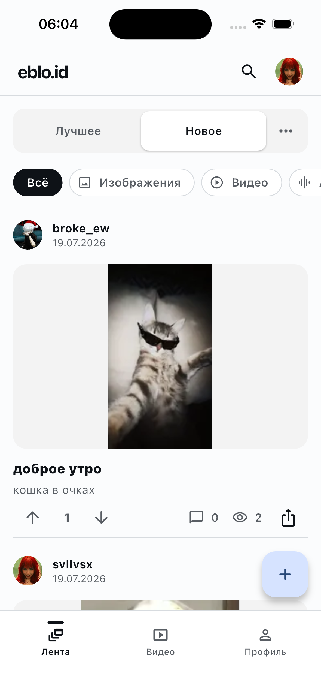
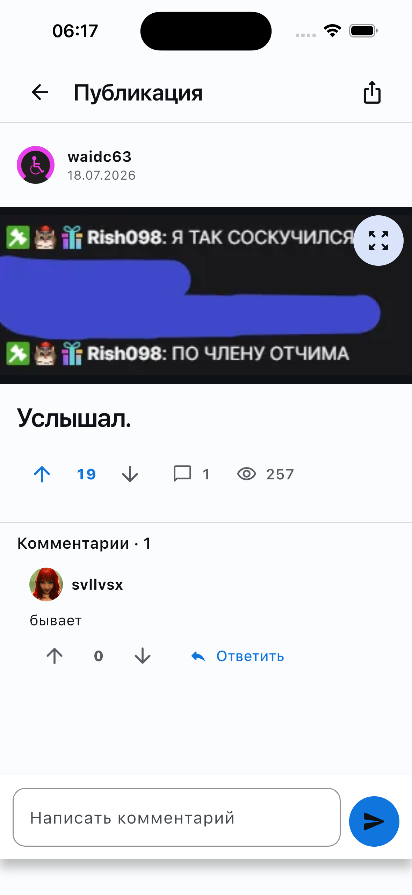
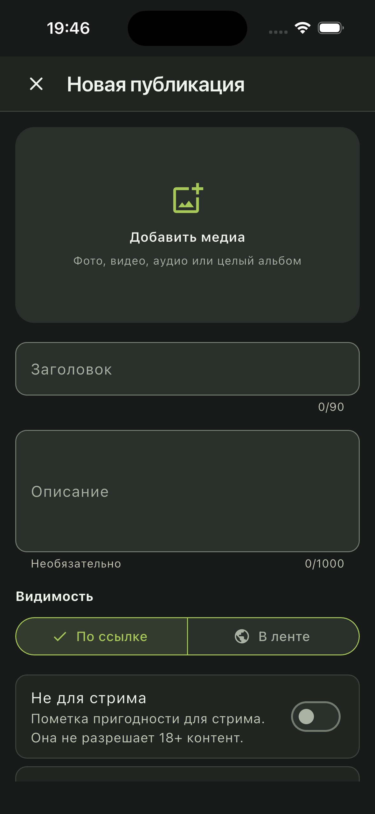
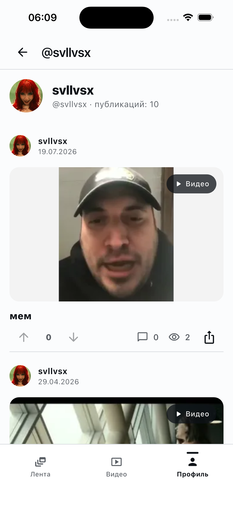

<p align="center">
  
</p>

<h1 align="center">Eblo.id</h1>

<p align="center">
  Flutter-клиент eblo.id для iOS и Android с одной кодовой базой и единым интерфейсом.
</p>

<p align="center">
  <a href="https://eblo.id">Открыть eblo.id</a>
</p>

<table align="center">
  <tr>
    <td align="center" width="760">
      <h3>Поддержите разработку мобильного клиента</h3>
      <p>Поддержка помогает развивать мобильный клиент, тестировать платформенные сценарии и доводить проект до полноценного релиза.</p>
      <table align="center">
        <tr>
          <td align="center" width="350"><a href="https://t.me/tribute/app?startapp=dK9j"></a></td>
          <td align="center" width="350"><a href="https://nowpayments.io/donation/svllvsx"></a></td>
        </tr>
        <tr>
          <td align="center" colspan="2"><a href="https://t.me/svllvsxprod"></a></td>
        </tr>
      </table>
    </td>
  </tr>
</table>

<p align="center">
  
  
  
  
</p>

<p align="center">
  <a href="#готово-и-работает">Готово</a> ·
  <a href="#интерфейс">Интерфейс</a> ·
  <a href="#архитектура">Архитектура</a> ·
  <a href="#модель-безопасности">Безопасность</a> ·
  <a href="#текущие-ограничения">Ограничения</a>
</p>

## О Проекте

Eblo.id — нативный по поведению мобильный клиент для просмотра и публикации пользовательского медиаконтента на [eblo.id](https://eblo.id).

Приложение использует одно Flutter-дерево интерфейса для iOS и Android. Платформенные различия изолированы в адаптерах авторизации, безопасного хранилища, выбора файлов, воспроизведения медиа, системной отправки ссылок и deep links.

Проект находится в активной разработке. Текущий код уже поддерживает основной пользовательский маршрут, но пока не считается готовым к публикации в App Store и Google Play.

Публичный репозиторий содержит демонстрационный снимок интерфейса и часть исходного кода. Entrypoint и remote integration layer намеренно не публикуются, поэтому собрать приложение только из этого репозитория нельзя.

## Альфа-Сборка

Текущая тестовая версия доступна в [GitHub Releases](https://github.com/svllvsxprod/ebloid_client/releases/tag/v1.0.0-alpha.1).

Это debug APK для тестирования альфа-версии. Сборка не предназначена для публикации в Google Play или использования как production release.

## Интерфейс

<table>
  <tr>
    <th>Лента</th>
    <th>Публикация</th>
    <th>Создание</th>
    <th>Профиль</th>
  </tr>
  <tr>
    <td></td>
    <td></td>
    <td></td>
    <td></td>
  </tr>
</table>

## Готово И Работает

- ✅ Общая лента с сортировками, периодами, фильтрами по типу медиа, обновлением и пагинацией.
- ✅ Изображения, видео, аудио, одиночные публикации и альбомы.
- ✅ Экран публикации с исходным соотношением сторон и полноэкранным просмотром изображений.
- ✅ Нативное воспроизведение видео и аудио.
- ✅ Twitch-авторизация на Android и iOS через изолированный eblo.id WebView flow.
- ✅ Безопасное сохранение и восстановление eblo.id session через Android Keystore и iOS Keychain.
- ✅ Профиль активного пользователя, публичные профили и публикации автора.
- ✅ Upvote/downvote публикаций с восстановлением выбранной реакции.
- ✅ Реакции на комментарии и ответы с optimistic update и откатом при ошибке.
- ✅ Комментарии и вложенные ответы.
- ✅ Создание публикаций с изображениями, видео, аудио и несколькими файлами.
- ✅ Публикации «В ленте» и «По ссылке».
- ✅ Защищённый локальный черновик, прогресс загрузки, отмена и повтор.
- ✅ Общий поиск по публикациям, видео и пользователям.
- ✅ Системная отправка канонической ссылки на публикацию.
- ✅ Единый адаптивный интерфейс, название и launcher icons для Android и iOS.
- ✅ Опубликованная Android debug alpha APK и проверенная iOS Simulator сборка.

## Архитектура

```text
iOS / Android
  -> Flutter UI
  -> Riverpod controllers и dependency injection
  -> Domain models и repository interfaces
  -> Dio / platform adapters / secure storage
  -> подтверждённые web compatibility endpoints eblo.id
```

Основные принципы:

- `go_router` управляет общим route graph и deep links.
- UI зависит от domain models и controllers, а не от transport DTO.
- Remote, cache и platform logic скрыты за repository/adapters.
- API origin задаётся через проверенную build configuration.
- Неподтверждённые backend-возможности не подменяются фиктивными данными.
- Один media-first дизайн и одна тема используются на обеих платформах.

## Модель Безопасности

- Клиент сохраняет только eblo.id cookie `session`; Twitch cookies и tokens не переносятся в приложение.
- Session хранится через Keychain/Android Keystore-backed secure storage.
- CSRF token обновляется перед authenticated mutations.
- Session cookie передаётся только на точный HTTPS origin `eblo.id`.
- Upload filenames нормализуются и не раскрывают исходные локальные пути.
- Draft и локальные реакции разделяются по пользователю и очищаются по auth lifecycle.
- Tokens, cookies, тексты комментариев, media paths и signed URLs не должны попадать в logs.
- Cleartext traffic и отключение TLS validation не используются.

## Публичный Исходный Код

Из публичного source snapshot намеренно исключены компоненты, необходимые для сборки и подключения к backend:

- Entrypoint и composition root приложения.
- API client и transport wiring.
- Authenticated mutation guard.
- Remote repositories для auth, content и upload.
- Session interceptor для authenticated requests.

Готовая тестовая Android-сборка публикуется только через GitHub Releases.

## Документация

- README содержит публичное описание, команды сборки, архитектуру и известные ограничения.
- Внутренняя продуктовая, исследовательская и development-документация не публикуется в репозитории.

## Текущие Ограничения

- Turnstile/CAPTCHA challenge пока возвращается как recoverable blocker без встроенного challenge UI.
- Background/resumable upload и server-side cleanup требуют дополнительного backend/platform решения.
- Offline cache для feed, post, comments и profile ещё не завершён.
- Report, block/mute, account deletion и другие обязательные UGC store flows ещё не реализованы.
- Deep links и OAuth-return требуют финального physical smoke на поддерживаемых iOS/Android версиях.
- Notifications/push и полный video suggestion flow относятся к следующим релизам.

## Статус Разработки

Актуальная тестовая Android-сборка доступна в alpha release. Известные пользовательские ограничения перечислены выше.
